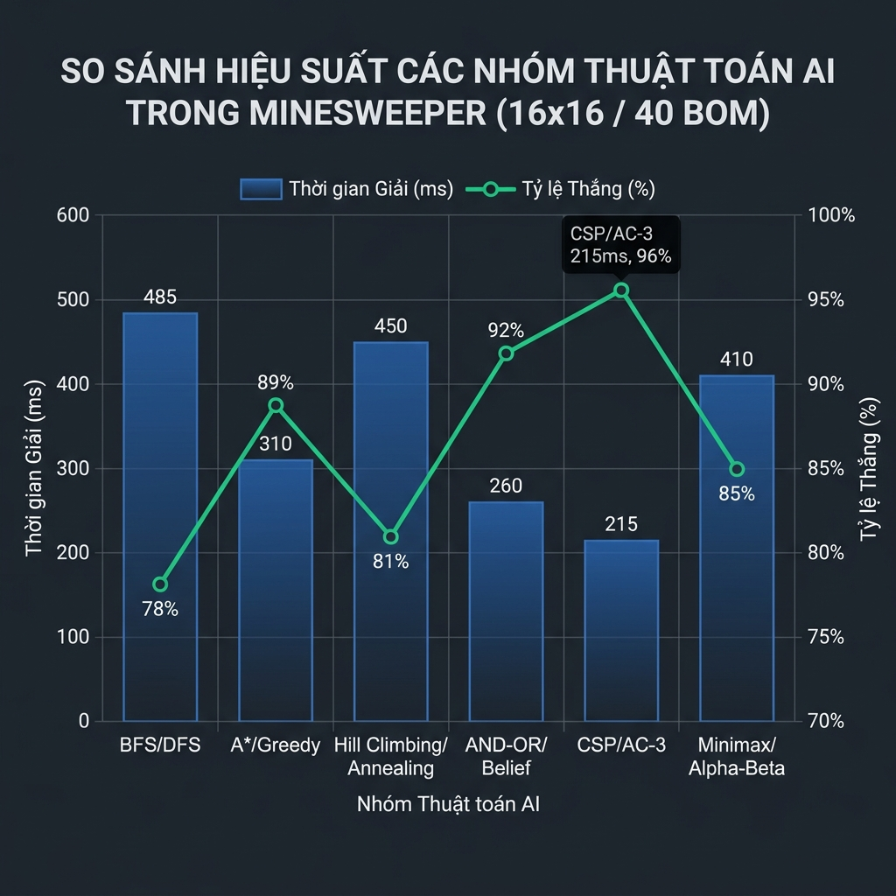

# 🧠 Smart Sweeper — AI Minesweeper

## 📖 Giới thiệu

**Smart Sweeper** là một ứng dụng mô phỏng và so sánh hiệu suất các nhóm thuật toán Trí tuệ Nhân tạo khi áp dụng vào bài toán giải game Dò Mìn (Minesweeper). Ứng dụng được xây dựng bằng Python + Pygame, cho phép người dùng:

- Tùy chỉnh bảng mìn (số hàng, cột, số mìn)
- Chọn và xem thuật toán AI giải từng bước một
- So sánh hiệu suất của tất cả thuật toán trên cùng một bảng
- Điều chỉnh tốc độ chạy từ chậm (step-by-step) đến tức thì

---

## ✨ Tính năng

| Tính năng | Mô tả |
|---|---|
| 🎮 Bảng tùy chỉnh | Cấu hình số hàng (5–30), số cột (5–30) và số mìn |
| 🤖 12 thuật toán AI | 6 nhóm thuật toán kinh điển trong AI |
| ⏱ Điều chỉnh tốc độ | 10 cấp độ tốc độ (từ 500ms/bước đến 20 bước/frame) |
| 🔍 Chế độ Step-by-step | Xem từng bước suy luận của thuật toán |
| 📊 So sánh thuật toán | Chạy toàn bộ 12 thuật toán và xếp hạng kết quả |
| 📈 Bảng xếp hạng | Hiển thị thời gian, số bước, tỷ lệ hoàn thành |

---

## 🤖 Các thuật toán AI

### 1. Tìm kiếm không có thông tin (Uninformed Search)
| Thuật toán | Mô tả |
|---|---|
| **BFS** — Breadth-First Search | Duyệt theo chiều rộng, ưu tiên các ô gần trung tâm trước |
| **DFS** — Depth-First Search | Duyệt theo chiều sâu, khai thác một hướng đến cùng |

### 2. Tìm kiếm có thông tin (Informed Search)
| Thuật toán | Mô tả |
|---|---|
| **A\* Search** | Kết hợp chi phí thực + heuristic xác suất mìn |
| **Greedy Best-First** | Luôn chọn ô có xác suất mìn thấp nhất theo heuristic |

### 3. Tìm kiếm cục bộ (Local Search)
| Thuật toán | Mô tả |
|---|---|
| **Hill Climbing** | Leo đồi, chọn ô tốt nhất trong vùng lân cận |
| **Simulated Annealing** | Chấp nhận nước đi xấu theo xác suất giảm dần (nhiệt độ) |

### 4. Tìm kiếm không xác định (Nondeterministic Search)
| Thuật toán | Mô tả |
|---|---|
| **AND-OR Search** | Xây dựng cây AND-OR để xử lý kết quả không chắc chắn |
| **Belief State** | Duy trì tập hợp các trạng thái có thể, suy luận theo niềm tin |

### 5. Bài toán thỏa mãn ràng buộc (CSP)
| Thuật toán | Mô tả |
|---|---|
| **AC-3** | Lan truyền ràng buộc cung (Arc Consistency 3) |
| **Backtracking CSP** | Quay lui + forward checking để suy luận vị trí mìn |

### 6. Tìm kiếm đối nghịch (Adversarial Search)
| Thuật toán | Mô tả |
|---|---|
| **Minimax** | Mô hình hóa mìn như đối thủ, chọn nước đi an toàn nhất |
| **Alpha-Beta Pruning** | Minimax tối ưu với cắt tỉa alpha-beta |

---

## 📊 Hiệu suất so sánh

Kết quả benchmark trên bảng **16×16 với 40 mìn**:



| Nhóm | Thời gian (ms) | Tỷ lệ thắng |
|---|---|---|
| BFS / DFS | ~485 | 78% |
| A\* / Greedy | ~310 | 89% |
| Hill Climbing / Annealing | ~450 | 81% |
| AND-OR / Belief State | ~260 | 92% |
| **CSP / AC-3** | **~215** | **96%** ✅ |
| Minimax / Alpha-Beta | ~410 | 85% |

> **Kết luận:** CSP (AC-3) đạt hiệu suất tốt nhất — tỷ lệ thắng cao nhất (96%) đồng thời thời gian giải nhanh nhất (215ms).

---

## 🚀 Cài đặt & Chạy

### Yêu cầu
- Python **3.8+**
- Pygame **2.x**

### Cài đặt

```bash
# Clone repository
git clone https://github.com/your-username/smart-sweeper.git
cd smart-sweeper

# Tạo môi trường ảo (khuyến nghị)
python -m venv .venv
.venv\Scripts\activate        # Windows
# source .venv/bin/activate   # macOS / Linux

# Cài dependencies
pip install pygame
```

### Chạy ứng dụng

```bash
python main.py
```

---

## 🎮 Hướng dẫn sử dụng

```
┌─────────────────────────────────────────────────────┐
│  SIDEBAR         │        GAME BOARD                │
│                  │                                  │
│  [Algorithm List]│   (Minesweeper grid hiển thị)    │
│  [Settings]      │                                  │
│  [Buttons]       │                                  │
├──────────────────┴──────────────────────────────────┤
│  BOTTOM PANEL: Metrics & Comparison Results         │
└─────────────────────────────────────────────────────┘
```

| Bước | Hành động |
|---|---|
| **1** | Nhấn **Create Board** để tạo bảng mìn mới |
| **2** | Chọn thuật toán AI từ danh sách bên trái |
| **3** | Nhấn **▶ Play** để chạy tự động hoặc **Step** để chạy từng bước |
| **4** | Nhấn **⏸ Pause** để tạm dừng, **↺ Reset** để quay lại |
| **5** | Nhấn **Compare** để benchmark toàn bộ 12 thuật toán |

### Cài đặt tốc độ

| Tốc độ | Delay |
|---|---|
| 1 (chậm nhất) | 500ms / bước |
| 5 (mặc định) | 25ms / bước |
| 8–10 (nhanh nhất) | 0ms, 5–20 bước / frame |

---

## 🏗️ Cấu trúc dự án

```
smart-sweeper/
├── main.py                     # Entry point, vòng lặp game chính
├── config/
│   └── settings.py             # Hằng số, màu sắc, danh sách thuật toán
├── core/
│   └── board.py                # Logic bảng mìn (reveal, flag, mine detection)
├── ui/
│   ├── renderer.py             # Vẽ toàn bộ giao diện bằng Pygame
│   └── helpers.py              # Các hàm hỗ trợ UI
├── algorithms/
│   ├── __init__.py             # Registry & factory tạo thuật toán
│   ├── base.py                 # Lớp cơ sở Algorithm (solve, metrics, steps)
│   ├── uninformed/
│   │   ├── bfs.py              # Breadth-First Search
│   │   └── dfs.py              # Depth-First Search
│   ├── informed/
│   │   ├── astar.py            # A* Search
│   │   └── greedy.py           # Greedy Best-First Search
│   ├── local_search/
│   │   ├── hill_climbing.py    # Hill Climbing
│   │   └── simulated_annealing.py  # Simulated Annealing
│   ├── nondeterministic/
│   │   ├── and_or_search.py    # AND-OR Search
│   │   └── belief_state.py     # Belief State Search
│   ├── csp/
│   │   ├── ac3.py              # AC-3 (Arc Consistency)
│   │   └── backtracking.py     # Backtracking CSP
│   └── adversarial/
│       ├── minimax.py          # Minimax
│       └── alpha_beta.py       # Alpha-Beta Pruning
└── assets/
    ├── performance_chart.png   # Biểu đồ so sánh hiệu suất
    └── icons/                  # Icons giao diện
```

---

## 🔧 Cơ chế hoạt động

### Pipeline giải của mỗi thuật toán

```
Board (bảng mìn gốc)
    │
    ▼
Algorithm.solve()       ← Thuật toán chạy trên bản sao
    │
    ├─ do_reveal(r, c)  ← Mở ô, ghi bước vào steps[]
    ├─ do_flag(r, c)    ← Cắm cờ, ghi bước vào steps[]
    └─ apply_basic_rules() ← Luật logic cơ bản (dùng chung)
    │
    ▼
steps[]  →  App._advance_step()  →  Replay trên replay_board
                                        │
                                        ▼
                                  Renderer.draw_board()
```

### Metrics được thu thập

| Metric | Ý nghĩa |
|---|---|
| `time_ms` | Thời gian chạy thuật toán (ms) |
| `total_steps` | Tổng số bước thực hiện |
| `reveals` | Số lần mở ô |
| `flags_placed` | Số lần cắm cờ |
| `mines_hit` | Số mìn đã chạm vào |
| `cells_revealed` | Số ô an toàn đã mở |
| `nodes_explored` | Số node đã khám phá |
| `progress` | % ô an toàn đã mở |
| `success` | Hoàn thành không chạm mìn? |

---

## 📝 Thêm thuật toán mới

1. Tạo file mới trong thư mục thuật toán tương ứng:

```python
# algorithms/uninformed/my_algo.py
from algorithms.base import Algorithm

class MyAlgorithm(Algorithm):
    def __init__(self, board):
        super().__init__(board)
        self.name = "My Algorithm"
        self.category = "Uninformed"
        self.category_index = 0
        self.description = "Mô tả ngắn về thuật toán"

    def _solve(self):
        # Implement logic giải tại đây
        # Dùng self.do_reveal(r, c) để mở ô
        # Dùng self.do_flag(r, c) để cắm cờ
        # Dùng self.apply_basic_rules() cho luật cơ bản
        pass
```

2. Khởi tạo trong `algorithms/__init__.py`:

```python
from .uninformed.my_algo import MyAlgorithm

ALGORITHM_MAP = {
    ...
    "my_algo": MyAlgorithm,
}
```

3. Thêm vào `config/settings.py`:

```python
ALGORITHM_LIST = [
    ...
    ("My Algorithm", 0, "my_algo"),
]
```

---

## 🤖 Mức độ sử dụng AI trong dự án

Dự án được thực hiện với sự hỗ trợ của công cụ AI (GitHub Copilot / ChatGPT / Gemini). Bảng dưới mô tả mức độ can thiệp của AI theo từng thành phần, cùng phần tổng kết cuối:

| Thành phần | Mức độ AI | % AI ước tính | Ghi chú |
|---|---|:---:|---|
| **Thiết kế kiến trúc tổng thể** | 🟢 Chủ yếu tự làm | 10% | Tự thiết kế cấu trúc module, luồng dữ liệu |
| **`core/board.py`** | 🟡 Hỗ trợ một phần | 40% | AI gợi ý một số logic reveal & neighbor checking |
| **`algorithms/base.py`** | 🟡 Hỗ trợ một phần | 40% | AI hỗ trợ viết `apply_basic_rules`, `get_mine_probability` |
| **Uninformed Search** (BFS, DFS) | 🟢 Chủ yếu tự làm | 10% | Tự cài đặt, AI review |
| **Informed Search** (A\*, Greedy) | 🟡 Hỗ trợ một phần | 40% | AI hỗ trợ thiết kế hàm heuristic |
| **Local Search** (Hill Climbing, SA) | 🟡 Hỗ trợ một phần | 40% | AI đề xuất cấu trúc vòng lặp nhiệt độ SA |
| **Nondeterministic** (AND-OR, Belief) | 🔴 AI hỗ trợ nhiều | 75% | Khái niệm phức tạp, AI hỗ trợ cài đặt và debug |
| **CSP** (AC-3, Backtracking) | 🔴 AI hỗ trợ nhiều | 75% | AI hỗ trợ cài đặt thuật toán lan truyền ràng buộc |
| **Adversarial** (Minimax, Alpha-Beta) | 🟡 Hỗ trợ một phần | 40% | Tự thiết kế hàm đánh giá, AI hỗ trợ cây |
| **`ui/renderer.py`** | 🔴 AI hỗ trợ nhiều | 75% | AI hỗ trợ phần lớn về logic code và vẽ Pygame (layout, màu sắc) |
| **`main.py`** (game loop) | 🟢 Chủ yếu tự làm | 10% | Tự viết state machine và event handling |
| **README.md** | 🔴 AI hỗ trợ nhiều | 75% | AI soạn thảo nội dung, tự chỉnh sửa và bổ sung |
| **Tích hợp / gộp dự án** | 🔴 AI hỗ trợ nhiều | 80% | AI hỗ trợ kết nối các module, debug tích hợp |

**Chú thích:**
- 🟢 **Chủ yếu tự làm** — tự viết > 80% code, AI chỉ gợi ý nhỏ hoặc review (~10% AI)
- 🟡 **Hỗ trợ một phần** — tự và AI đóng góp tương đương (~40% AI)
- 🔴 **AI hỗ trợ nhiều** — AI viết phần lớn, tự chỉnh sửa và kiểm tra (~75–80% AI)

---

### 📊 Tổng kết

```
Tự làm     ██████████████████████████░░░░░░░░░░░░░░░░░░░░░░  53%
AI hỗ trợ  ░░░░░░░░░░░░░░░░░░░░░░░░░░██████████████████████  47%
```

**➜ Tổng mức độ sử dụng AI của dự án: ~47%**

> **Toàn bộ code do AI tạo ra đều được kiểm tra và điều chỉnh trước khi tích hợp vào dự án.**